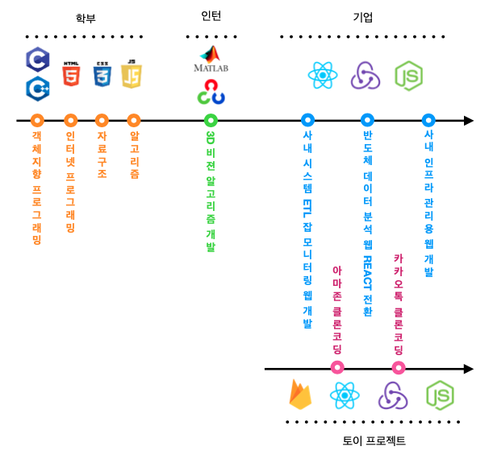

---
### 유재섭 (Jaeseop Yoo)
&nbsp;&nbsp;&nbsp;&nbsp;       연 락 처 : 010-9040-1608  
&nbsp;&nbsp;&nbsp;&nbsp;&nbsp; 이 메 일 : octo756@naver.com  
&nbsp;&nbsp;&nbsp;&nbsp;&nbsp; 깃 허 브 : https://github.com/JSYOvO/  
&nbsp;&nbsp;&nbsp;&nbsp;&nbsp; 블 로 그 : https://jsyovo.tistory.com/

##### <간략한 소개>  
&nbsp;&nbsp;&nbsp;&nbsp;       현재 직장에서 주로 반도체 데이터를 수집하고 가공하여 인사이트를 찾고,  
&nbsp;&nbsp;&nbsp;&nbsp;&nbsp; 가공한 데이터 및 인사이트를 확인할 수 있는 웹페이지를 개발하고 있습니다.  
&nbsp;&nbsp;&nbsp;&nbsp;&nbsp; 그리고 퇴근 후엔 리액트로 여러가지 재미있는 것, 새로운 것들을 빌드하며 지냅니다.

  
  

##### <프로젝트>  
---
&nbsp; **사내 시스템 관리용 웹서비스 개발 [2020.05 - 2020.09]**  
&nbsp;&nbsp; 반도체 데이터 분석 시스템 내 수 많은 ETL 잡, 데이터 생성 및 가공, 데이터베이스 상태  
&nbsp;&nbsp; 관리 및 업무자동화를 위한 웹서비스를 개발하였습니다.  
&nbsp;&nbsp; 수 많은 현황들을 알기쉽게 제공하기 위해 D3.js 라이브러리를 활용한 데이터시각화에   
&nbsp;&nbsp; 중점을 두었습니다.

&nbsp;&nbsp;&nbsp; - Technical  
&nbsp;&nbsp;&nbsp;&nbsp;&nbsp;&nbsp;&nbsp;&nbsp; *Web-Front : ReactJS + Hooks, Material-Ui, D3.js*  
&nbsp;&nbsp;&nbsp;&nbsp;&nbsp;&nbsp;&nbsp;&nbsp; *Web-Back : 기존 시스템 서버 그대로 활용 (.Net)*  

&nbsp;&nbsp;&nbsp; - Project  
&nbsp;&nbsp;&nbsp;&nbsp;&nbsp;&nbsp;&nbsp; *프로젝트 리더와 지속적인 소통을 통해 요구사항 및 개발진행 상황 공유*  
&nbsp;&nbsp;&nbsp;&nbsp;&nbsp;&nbsp;&nbsp; *시스템 내 수 많은 정보들을 한눈에 알기쉽게 제공*

---    
&nbsp; **반도체 데이터 분석 웹서비스 개발 [2019.05 ~ 2019.12]**  
&nbsp;&nbsp; 반도체 데이터 분석 시스템을 ReactJS 기반의 신규버젼으로 구축하였습니다.  
&nbsp;&nbsp; 특히 다양한 개발자 분들이 쉽게 개발 수 있도록 컴포넌트 개발에 집중하였습니다.  
&nbsp;&nbsp; 기존의 .Net 기반 웹서비스에 비해 빠른속도 및 깔끔한 UX 제공을 목표로 하였습니다.     

&nbsp;&nbsp;&nbsp; - Technical  
&nbsp;&nbsp;&nbsp;&nbsp;&nbsp;&nbsp;&nbsp;&nbsp; *Web-Front : ReactJS + Hooks, Redux, Material-Ui, D3.js*  
&nbsp;&nbsp;&nbsp;&nbsp;&nbsp;&nbsp;&nbsp;&nbsp; *Web-Back : 기존 시스템 서버 그대로 활용 (.Net)*  

&nbsp;&nbsp;&nbsp; - Project  
&nbsp;&nbsp;&nbsp;&nbsp;&nbsp;&nbsp;&nbsp; *기존 시스템이 워낙 거대했기에 상대적으로 많은 인력이 프로젝트에 투입되어*  
&nbsp;&nbsp;&nbsp;&nbsp;&nbsp;&nbsp;&nbsp; *소통하고 협업하는 방법을 배움*  
&nbsp;&nbsp;&nbsp;&nbsp;&nbsp;&nbsp;&nbsp; *기존과 다른 직관적이고 만족도 높은 UI/UX 제공을 위해 CX팀과도 지속적인 협력*  

---    
&nbsp; **반도체 데이터 ETL잡 및 웹서비스 개발 [2018.10 ~ 2019.03]**  
&nbsp;&nbsp; 반도체 시스템 간의 신규 ETL 잡을 개발하였습니다.   
&nbsp;&nbsp; 직관성이 높아 시스템을 운영하기에 편리한 Apache 사의 NIFI를 활용하였습니다.  
&nbsp;&nbsp; NIFI ETL 잡의 기준정보, 진행상황, 서버상태, 로그상황 등을 빠르기 확인하기 위해서  
&nbsp;&nbsp; 간단한 ReactJS 기반 운영용 웹서비스를 추가로 구축하였습니다.

&nbsp;&nbsp;&nbsp; - Technical  
&nbsp;&nbsp;&nbsp;&nbsp;&nbsp;&nbsp;&nbsp;&nbsp; *Web-Front : ReactJS(운영용 웹)*  
&nbsp;&nbsp;&nbsp;&nbsp;&nbsp;&nbsp;&nbsp;&nbsp; *Web-Back : Linux Server(NIFI) / 기존시스템 서버 그대로 활용 (.Net, 운영용 웹)*  

&nbsp;&nbsp;&nbsp; - Project  
&nbsp;&nbsp;&nbsp;&nbsp;&nbsp;&nbsp;&nbsp; *1인 프로젝트로 개발 목표수립부터 실제 배포까지 모두 혼자 진행*  
&nbsp;&nbsp;&nbsp;&nbsp;&nbsp;&nbsp;&nbsp; *NIFI의 경우는 현재 해당 시스템을 운영중인 부서 담당자분께 컨택하여 얻은 관련 지식*    
&nbsp;&nbsp;&nbsp;&nbsp;&nbsp;&nbsp;&nbsp; *및 자료를 바탕으로 구축*  
&nbsp;&nbsp;&nbsp;&nbsp;&nbsp;&nbsp;&nbsp; *처음으로 ReactJS 를 활용한 프로젝트였기에 개발과정에서 공부하고 얻은 지식을 매주*  
&nbsp;&nbsp;&nbsp;&nbsp;&nbsp;&nbsp;&nbsp; *부서원들과 공유하는 시간을 가짐*   

---       
&nbsp; **3D 비젼 알고리즘 개발 [2017.12 ~ 2018.05]**  
&nbsp;&nbsp; 피부분석을 위한 3D 스캔 비젼 알고리즘을 개발하였습니다.  
&nbsp;&nbsp; OpenCV 및 다양한 3D 모델링 알고리즘 및 오차보정 알고리즘을 구현하고 현 시스템에   
&nbsp;&nbsp; 가장 적합한 알고리즘을 찾았습니다.  
&nbsp;&nbsp; 알고리즘 개발뿐 아니라 하드웨어 모델링도 함께 진행하여 색다른 경험이었습니다.  

&nbsp;&nbsp;&nbsp; - Technical  
&nbsp;&nbsp;&nbsp;&nbsp;&nbsp;&nbsp;&nbsp;&nbsp; *대표 알고리즘 : Phase Shift, Phase Unwrapping*  

&nbsp;&nbsp;&nbsp; - Project  
&nbsp;&nbsp;&nbsp;&nbsp;&nbsp;&nbsp;&nbsp; *알고리즘을 실제로 구현하고 현재 스캐닝 시스템에서 어느정도 효율이 나오는지 확인*  
&nbsp;&nbsp;&nbsp;&nbsp;&nbsp;&nbsp;&nbsp; *프로젝트 리더분께 계속해서 알고리즘 효율성을 피드백 받으며 더 좋은 알고리즘 개발*  
&nbsp;&nbsp;&nbsp;&nbsp;&nbsp;&nbsp;&nbsp; *다양한 업무를 진행하여 여러구성원들과 협업하여 진행*    

##### <토이 프로젝트>  
---
&nbsp; **카카오톡 클론**  
&nbsp;&nbsp; 카카오톡의 회원가입, 로그인, 친구추가, 채팅을 ReactJS SPA로 구현하였습니다.  
&nbsp;&nbsp; 회원가입 및 로그인 : Firebase의 Authentication을 활용 하였으며, 인증을 통해 얻은  
&nbsp;&nbsp;&nbsp;&nbsp;&nbsp;&nbsp;&nbsp;&nbsp;&nbsp;&nbsp;&nbsp;&nbsp;&nbsp;&nbsp;&nbsp;&nbsp;&nbsp;&nbsp;&nbsp;&nbsp;&nbsp;&nbsp;&nbsp;&nbsp;&nbsp;&nbsp;&nbsp;&nbsp;&nbsp;&nbsp;&nbsp;&nbsp;&nbsp;&nbsp;&nbsp;&nbsp;&nbsp;&nbsp;&nbsp;&nbsp;&nbsp; 계정정보는 Redux로 데이터 레이어에서 관리하였습니다.  
&nbsp;&nbsp; 친구추가 및 채팅 : 각 계정의 친구 및 채팅정보는 Firestore로 실시간 관리하였고,  
&nbsp;&nbsp;&nbsp;&nbsp;&nbsp;&nbsp;&nbsp;&nbsp;&nbsp;&nbsp;&nbsp;&nbsp;&nbsp;&nbsp;&nbsp;&nbsp;&nbsp;&nbsp;&nbsp;&nbsp;&nbsp;&nbsp;&nbsp;&nbsp;&nbsp;&nbsp;&nbsp;&nbsp;&nbsp;&nbsp;&nbsp;&nbsp;&nbsp;&nbsp;&nbsp;&nbsp;&nbsp; 친구정보 또한 Redux로 관리하였습니다.  

&nbsp;&nbsp;&nbsp; - Technical  
&nbsp;&nbsp;&nbsp;&nbsp;&nbsp;&nbsp;&nbsp;&nbsp; *Web-Front : ReactJS + Hooks, Redux, Material-Ui*  
&nbsp;&nbsp;&nbsp;&nbsp;&nbsp;&nbsp;&nbsp;&nbsp; *Web-Back : Firebase*  

&nbsp;&nbsp;&nbsp; - Link  
&nbsp;&nbsp;&nbsp;&nbsp;&nbsp;&nbsp;&nbsp;&nbsp; *[깃 허 브](https://github.com/JSYOvO/KakaoTalk-Clone)*  
&nbsp;&nbsp;&nbsp;&nbsp;&nbsp;&nbsp;&nbsp;&nbsp; *[D E M O](https://kakaotalk-clone.web.app)*  
&nbsp;&nbsp;&nbsp;&nbsp;&nbsp;&nbsp;&nbsp;&nbsp; *[포트폴리오](https://jsyovo.com/%ED%86%A0%EC%9D%B4%20%ED%94%84%EB%A1%9C%EC%A0%9D%ED%8A%B8-%EC%B9%B4%EC%B9%B4%EC%98%A4%ED%86%A1/)*  

---  
&nbsp; **아마존 클론**  
&nbsp;&nbsp; 아마존의 회원가입, 로그인, 제품 구매 및 결제 기능을 ReactJS SPA로 구현하였습니다.  
&nbsp;&nbsp; 회원가입 및 로그인 : Firebase의 Authentication을 활용하였습니다.  
&nbsp;&nbsp; 제품 구매 : 제품 구매 장바구니는 Context-Api를 통해 관리하였습니다.  
&nbsp;&nbsp; 결제 : Stripe로 진행하였으며, 관련동작을 하는 Express Server는 Firebase Functions  
&nbsp;&nbsp;&nbsp;&nbsp;&nbsp;&nbsp;&nbsp;&nbsp;&nbsp;&nbsp;&nbsp;&nbsp;&nbsp;&nbsp; Hosting에서 활용하였습니다.

&nbsp;&nbsp;&nbsp; - Technical  
&nbsp;&nbsp;&nbsp;&nbsp;&nbsp;&nbsp;&nbsp;&nbsp; *Web-Front : ReactJS + Hooks, Context-Api, Material-Ui*  
&nbsp;&nbsp;&nbsp;&nbsp;&nbsp;&nbsp;&nbsp;&nbsp; *Web-Back : Firebase*  
&nbsp;&nbsp;&nbsp;&nbsp;&nbsp;&nbsp;&nbsp;&nbsp; *Payment : Stripe, NodeJS Express Server + Firebase Functions Hosting*  

&nbsp;&nbsp;&nbsp; - Link  
&nbsp;&nbsp;&nbsp;&nbsp;&nbsp;&nbsp;&nbsp;&nbsp; *[깃 허 브](https://github.com/JSYOvO/Amazon-Clone)*  
&nbsp;&nbsp;&nbsp;&nbsp;&nbsp;&nbsp;&nbsp;&nbsp; *[D E M O](https://clone-31f17.web.app)*  
&nbsp;&nbsp;&nbsp;&nbsp;&nbsp;&nbsp;&nbsp;&nbsp; *[포트폴리오](https://jsyovo.com/%ED%86%A0%EC%9D%B4%20%ED%94%84%EB%A1%9C%EC%A0%9D%ED%8A%B8-%EC%95%84%EB%A7%88%EC%A1%B4/)*  
  