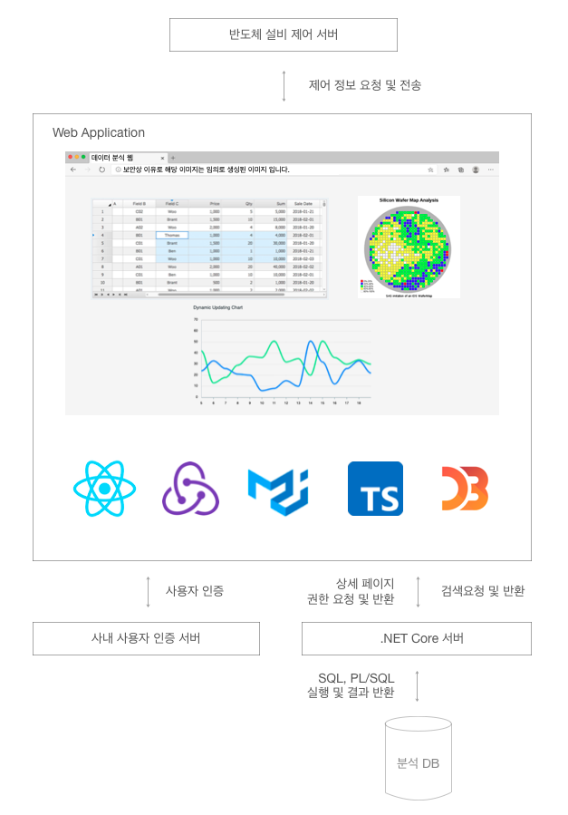

---
#### 유재섭 (Jaeseop Yoo)
연 락 처 : 010-9040-1608  
이 메 일 : octo756@naver.com  
깃 허 브 : https://github.com/JSYOvO/  
블 로 그 : https://jsyovo.tistory.com/

##### About Me  
현재 직장에서 주로 반도체 데이터를 수집하고 가공하여 인사이트를 찾고,  
가공한 데이터 및 인사이트를 확인할 수 있는 웹을 만드는 프론트앤드 개발자입니다.  
퇴근 후엔 리액트로 여러가지 재미있는 것, 새로운 것들을 빌드하며 지냅니다.

  

##### Project

**사내 인프라 관리용 웹 개발 [2020.05 - 2020.09]**  

사내 시스템 내 수 많은 인프라 현황 및 상태를 쉽게 파악할 수 있는 웹의 프론트앤드 개발을 담당하였습니다.

주요 기능  
⎯ 각 시스템의 로그를 분석하여 정형화된 포맷으로 DB에 데이터를 적재하고, 적재된 데이터를 차트 및 그래프 형태로 시각화하였습니다.
D3.js를 활용하여 데이터 시각화 진행하였습니다.  
⎯ 보안상 백엔드 서버에서 데이터를 수집 불가한 경우에는 ORM을 활용하여 타켓 DB의 PL/SQL을 직접 실행하여 데이터를 수집하였습니다.

기술 스택  
⎯ React, Redux, MaterialUI, TypeScript, D3.js

    

**반도체 데이터 분석 웹서비스 개발 [2019.05 ~ 2019.12]**  

기존의 반도체 데이터 웹을 React를 기반의 신규버전으로 개발하였습니다.
인력부족으로 React 경험이 없는 개발자 분들과 함께 진행하여, 다른 개발자 분들께서 쉽게 개발하실 수 있도록 전체 아키텍쳐 및 공용 컴포넌트 설계에 집중하였습니다.

주요 기능  
⎯ 약 70여개의 각기 다른 조회기능을 제공하는 세부 페이지로 구성되어 있습니다. 이로 인해 Bundle 파일 사이즈가 커짐에 따라
첫 페이지 로딩이 느려지는 문제가 발생하여 해결을 위해 Code Splitting 진행하였습니다.  
⎯ 반도체 산업 특성 상 많은 데이터를 한번에 조회 하는 경우가 많습니다. 대용량 데이터에 대한 성능 이슈 해결을 위해 Lazy Observable
개념 기반의 오픈소스 Toast Grid를 활용하였습니다.  
⎯ 많은 세부 페이지들에서 그래프를 사용합니다. 대부분의 라이브러리들에서 제공하는 일반적인 그래프 이외의 반도체 산업에 특화된
Wafer Map 등의 그래프가 필요하여 자유도가 높은 D3.js로 직접 필요한 기능들을 생성하였습니다.  
⎯ 데이터 시각화 작업 시 Oboe.js를 통해 스트리밍한 방식으로 처리하여 모든 데이터가 준비될때 까지의 기다림을 줄임으로서 사용자의
시스템 사용성을 높였습니다.  

기술 스택  
⎯ React, Redux, MaterialUI, TypeScript, D3.js

 
    
**사내 시스템 ETL 잡 모니터링 웹 개발 [2018.10 ~ 2019.03]**  

사내 시스템간의 신규 ETL잡을 개발하면서 해당 잡 들을 쉽게 모니터링 할 수 있는 웹서비스를 개발하였습니다.
첫 프론트엔드 프로젝트로 개발과정에서 공부하고 얻은 지식을 동료들과 공유하였습니다.

주요 기능  
⎯ 데이터베이스에 저장된 각 시스템의 ETL 로그분석 데이터를 가공하여 현재 ETL 정상동작여부 쉽게 확인하도록 화면에 출력하였습니다.

기술 스택  
⎯ React, MaterialUI

  

**3D 비젼 알고리즘 개발 [2017.12 ~ 2018.05]**  

3D 이미지 기반의 피부분석 시스템 구축을 위해 임베디드 시스템 구축 및 비젼 알고리즘을 개발하였습니다.

주요 기능  
⎯ Nvidia Tx2, TI 프로젝터 및 Leopard 비젼 시스템을 기반으로 임베디드 시스템을 구축하였습니다. 분석대상에 광학이미지를 출력하고 비젼 시스템을 통해 데이터를 생성하는 일련의 과정을 통합하였습니다.  
⎯ 3D 모델링에 관련된 논문들을 임베디드 시스템에 적용하여 현 시스템에 적합한 알고리즘을 찾았습니다. Phase Shift 알고리즘을 기반으로 진행하였고, 오차의 경우에는 Phase Unwrapping 알고리즘을 적용하여 성능을 개선하였습니다.  

기술 스택  
⎯ Matlab, OpenCV, 컴퓨터 비젼 이론, 3D 모델링 알고리즘  

  

##### <토이 프로젝트>  
---
 **카카오톡 클론**  
 카카오톡의 회원가입, 로그인, 친구추가, 채팅을 ReactJS SPA로 구현하였습니다.  
 회원가입 및 로그인 : Firebase의 Authentication을 활용 하였으며, 인증을 통해 얻은  
 계정정보는 Redux로 데이터 레이어에서 관리하였습니다.  
 친구추가 및 채팅 : 각 계정의 친구 및 채팅정보는 Firestore로 실시간 관리하였고,  
 친구정보 또한 Redux로 관리하였습니다.  

 - Technical  
 *Web-Front : ReactJS + Hooks, Redux, Material-Ui*  
 *Web-Back : Firebase*  

 - Link  
 *[깃 허 브](https://github.com/JSYOvO/KakaoTalk-Clone)*  
 *[D E M O](https://kakaotalk-clone.web.app)*  
 *[포트폴리오](https://jsyovo.com/%ED%86%A0%EC%9D%B4%20%ED%94%84%EB%A1%9C%EC%A0%9D%ED%8A%B8-%EC%B9%B4%EC%B9%B4%EC%98%A4%ED%86%A1/)*  

---  
 **아마존 클론**  
 아마존의 회원가입, 로그인, 제품 구매 및 결제 기능을 ReactJS SPA로 구현하였습니다.  
 회원가입 및 로그인 : Firebase의 Authentication을 활용하였습니다.  
 제품 구매 : 제품 구매 장바구니는 Context-Api를 통해 관리하였습니다.  
 결제 : Stripe로 진행하였으며, 관련동작을 하는 Express Server는 Firebase Functions  
 Hosting에서 활용하였습니다.

 - Technical  
 *Web-Front : ReactJS + Hooks, Context-Api, Material-Ui*  
 *Web-Back : Firebase*  
 *Payment : Stripe, NodeJS Express Server + Firebase Functions Hosting*  

 - Link  
 *[깃 허 브](https://github.com/JSYOvO/Amazon-Clone)*  
 *[D E M O](https://clone-31f17.web.app)*  
 *[포트폴리오](https://jsyovo.com/%ED%86%A0%EC%9D%B4%20%ED%94%84%EB%A1%9C%EC%A0%9D%ED%8A%B8-%EC%95%84%EB%A7%88%EC%A1%B4/)*  
  