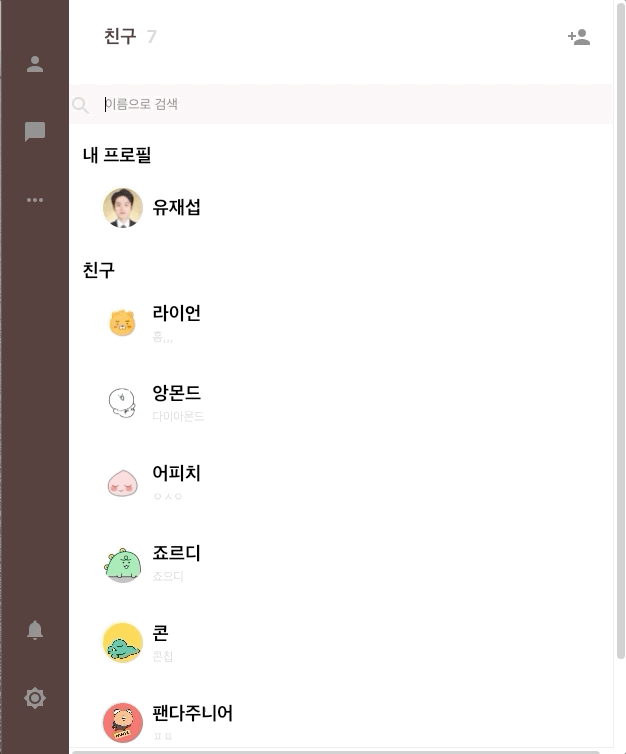

#### 회원가입, 로그인, 친구추가, 채팅을 ReactJS SPA로 구현하였습니다.

##### 사용 기술

    > ReactJS + Hooks
    > Redux
    > Material UI
    > Firebase - FireStore, Authentication, Hosting

##### 회원가입 및 로그인

Firebase의 Authentication을 활용해 회원가입 및 로그인 기능 구현하였습니다.
그리고 계정정보는 추가적으로 Redux로 데이터레이어에서 관리하였습니다.

##### 친구추가 및 채팅
각 계정의 친구 및 채팅정보는 Firestore로 실시간 관리하얐고, 친구정보는 추가적으로 Redux로 데이터레이어에서 관리하였습니다.

##### 후기
ReactJS를 활용하여 카카오톡을 만들어보았습니다. 간단한 빌드였지만 React, Redux, Firebase 등의 다양한 내용들을 다시한번 점검할 수 있던 시간이었습니다. 하지만 효율성과는 거리가 먼 빠른 결과만을 위한 빌드였기에 추후에 개선이 필요합니다.